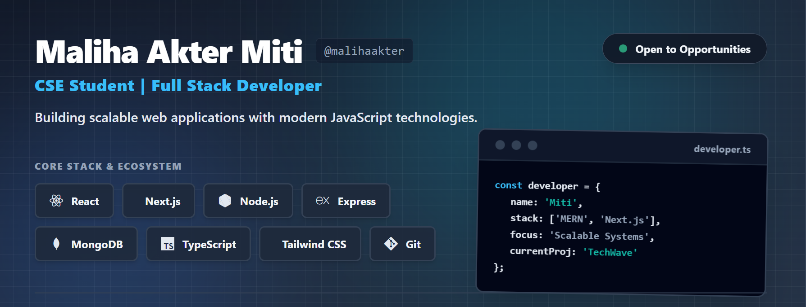

<!-- Custom Banner -->

# Hi 👋 I'm Maliha Akter Miti

### 

---

## 👩‍💻 About Me

I'm a passionate Full Stack Developer who enjoys building scalable web applications with modern JavaScript technologies.

I love solving real-world problems through software development and continuously improving my skills in web development, AI, and backend engineering.

---

## 🚀 Current Activities

- 🌱 Exploring **Next.js** and modern full-stack development
- 💼 Building real-world MERN/Next.js projects
- 📚 Practicing **Data Structures & Algorithms**
- 🤖 Learning **Artificial Intelligence & Machine Learning**
- 🎯 Preparing for Software Engineering opportunities

---

# 💻 Skills

### Frontend

### Backend

### Languages

### Tools

---

## 📊 GitHub Stats

 

## 🔥 GitHub Streak

  

 

## 📈 Contribution Graph

---

# 🌐 Connect with Me

---

⭐ Thanks for visiting my profile!

  

  

<!-- Waving Footer Banner -->

